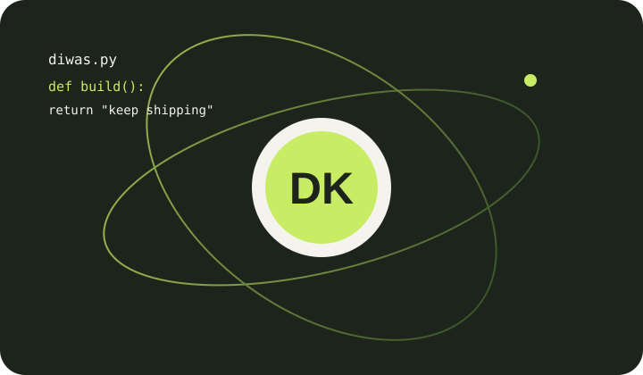
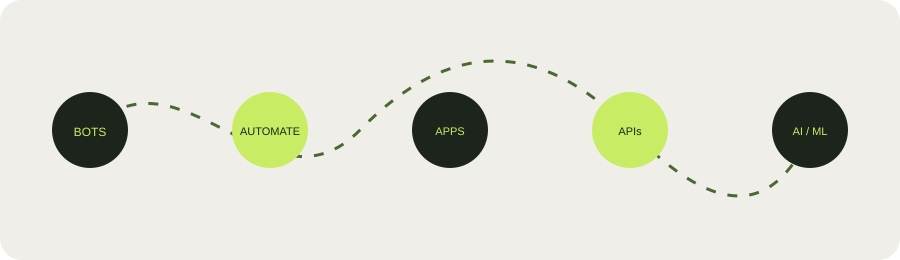

# Visual Showcase

The SVGs above are intentionally dependency-free and animated in browsers that support standard SVG animation primitives. They represent the portfolio's core themes: identity, curiosity, bots, automation, apps, APIs, and AI/ML experiments.

## Featured repository showcase

The portfolio itself presents public work rather than invented case studies:

- **NepBot** for bot and automation work.
- **NepTLS** for Python networking experiments.
- **NepaliCode** and **Nepali IDE** for language and developer-tool exploration.
- **World Explorer** for React and Three.js interaction.
- **nepal-phone** for a small reusable JavaScript package.
- **USB File Preview** for a local-first tool direction.

Project details and current links are maintained in [`CONTENT.md`](CONTENT.md) and the live site.
